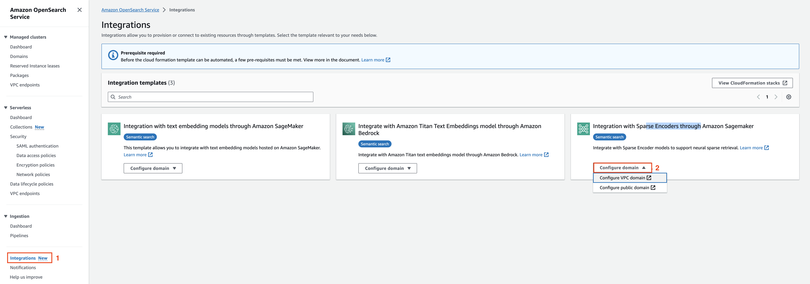
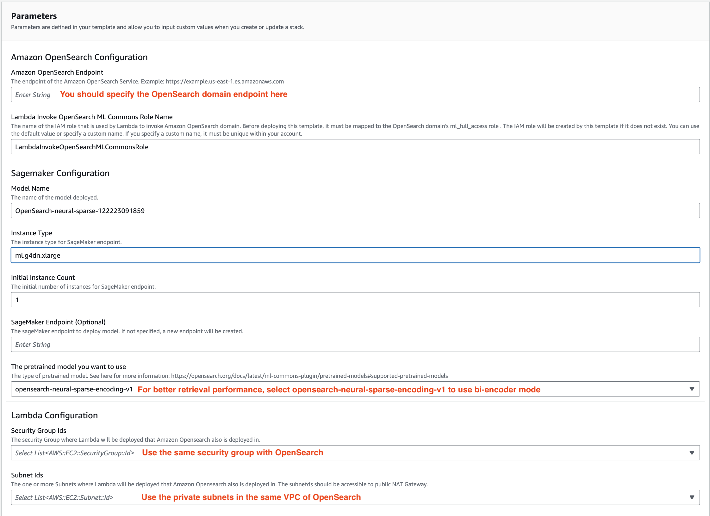
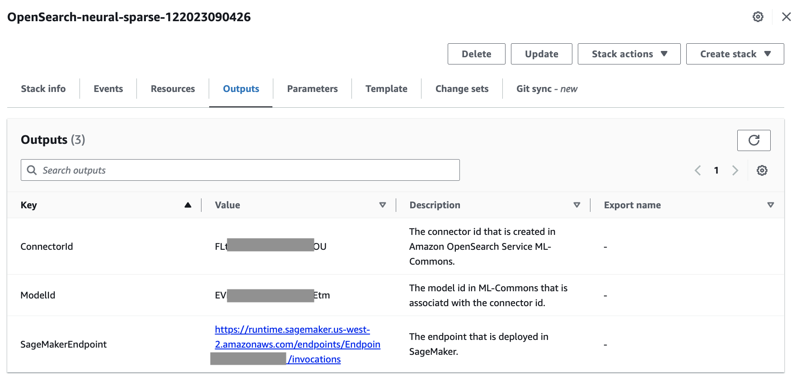

1. Setup dense and sparse hybird retrieval experiment environment
	- setup OpenSearch Domain
	  <br>*please refer AWS's documentation*

	- setup sparse model
   
	  - Use integration in Amazon OpenSearch
	  
	    
	  
	  - Setting for cloudformation template
	  
	    
	  
     - Get Sparse ModelID from output of Stack
     
	    
	  
	
	
	- setup dense model, related iam role and ingest/search pipelines
		```bash
		python3 setup_model_and_pipeline.py --aos_endpoint {aos_endpoint} --sparse_model_id {sparse_model_id} --index_name {index_name}
		```
		You can get the two dense_model_id in output log in the this step
	   1. doc_dense_model_id, which is for ingestion
	   2. query_dense_model_id, which is for search
	
2. Experiment Procedure
   - For Beir dataset
   	- ingest test data
	      ```shell
	      python3 benchmark-beir.py --aos_endpoint <aos_endpoint> --testset_size 3000 --index_name <index_name> --topk 20 --dense_model_id <dense_model_id> --sparse_model_id <sparse_model_id> --ingest
	      ```
	   - search benchmarking
	      ```shell
	      python3 benchmark-beir.py --aos_endpoint <aos_endpoint> --testset_size 3000 --index_name <index_name> --topk 20 --dense_model_id <dense_model_id> --sparse_model_id <sparse_model_id>
	      ```
	- For other dataset
   	- ingest test data
	      ```shell
	      python3 benchmark.py --aos_endpoint <aos_endpoint> --testset_size 3000 --index_name <index_name> --topk 20 --dense_model_id <dense_model_id> --sparse_model_id <sparse_model_id> --query_dataset_type "train" --ingest
	      ```
	   - search benchmarking
	      ```shell
	      python3 benchmark.py --aos_endpoint <aos_endpoint> --testset_size 3000 --index_name <index_name> --topk 20 --dense_model_id <dense_model_id> --sparse_model_id <sparse_model_id> --query_dataset_type "train"
	      ```